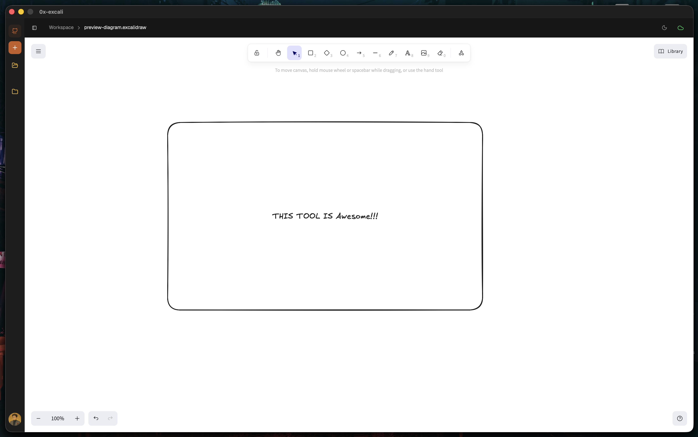

# 0x-excali

A lightweight desktop workspace for organizing Excalidraw drawings and syncing them with GitHub.

[](https://github.com/krafterlabs/0x-excali/releases/latest)
[](https://github.com/krafterlabs/0x-excali/actions/workflows/auto-release.yml)
[](https://github.com/krafterlabs/0x-excali/actions/workflows/validate-pr.yml)
[](LICENSE)
[](#downloads)

<p align="center">
  
</p>

## Overview

0x-excali is a native desktop application designed to provide a fast, local-first editing experience for visual thinkers. It elegantly integrates the open-source Excalidraw canvas with a local SQLite cache, automatically syncing your workspaces directly to your remote GitHub repositories. 

## Key Features

- **Local-first drawing workspace** — Fast, offline-capable editing with a local SQLite cache.
- **GitHub-backed sync** — Push-then-pull automated syncing keeps remote and local files consistent.
- **Repository-based organization** — Organize your drawings directly inside Git repositories.
- **Offline editing with queued sync** — Work on a plane, sync when you land.
- **Desktop app built with Wails** — Ultra-lightweight binaries via Go and React/Vite.
- **Excalidraw-powered canvas** — Full-featured drawing experience embedded natively.

## Downloads

Get the latest release from the [GitHub Releases page](https://github.com/krafterlabs/0x-excali/releases/latest).

| Platform | Asset |
|---|---|
| macOS | `.dmg` |
| Linux | `.tar.gz` |

## Installation

### macOS
Download the latest `.dmg` from the Releases page, open it, and drag **0x-excali** to your Applications folder.

**First launch — Gatekeeper prompt**
Because 0x-excali is not yet notarized through the Mac App Store, macOS may show _"0x-excali can't be opened"_. To allow it:
1. Right-click (or Control-click) the app in Applications → **Open** → click **Open** in the dialog.
2. Alternatively, run `xattr -dr com.apple.quarantine /Applications/0x-excali.app` in your Terminal. You only need to do this once.

### Linux
Download and extract the latest `.tar.gz`. The extracted directory contains the standalone `0x-excali` binary. You can run this binary directly or add it to your system PATH.

## Development

**Prerequisites:** 
- Go `1.25.0` (pinned in `go.mod`)
- Node.js `24` (pinned in `.nvmrc`)
- pnpm `11.17.0` (pinned in `packageManager`)
- [Wails CLI](https://wails.io/docs/gettingstarted/installation)

```bash
# 1. Clone
git clone https://github.com/krafterlabs/0x-excali.git && cd 0x-excali

# 2. Set up Git hooks
make setup

# 3. Install frontend dependencies
cd frontend && pnpm install

# 4. Run dev server
make dev
```

## Production Build

0x-excali uses a unified build script to ensure local production builds perfectly match CI outputs.

**Build for macOS (Universal):**
```bash
./scripts/build-production.sh --target macos --package dmg
```

**Build for Linux (amd64):**
```bash
./scripts/build-production.sh --target linux --package tar.gz
```

## Release Process

We utilize an automated release pipeline powered by GitHub Actions:
1. **Pull Requests**: Code pushed to a PR against `master` triggers the PR validation workflow.
2. **Merge**: When a PR is merged into `master`, the `auto-release` workflow begins.
3. **Cross-Platform Compilation**: The pipeline concurrently builds the macOS universal binary and the Linux amd64 binary using `scripts/build-production.sh`.
4. **Draft Release**: Once both builds succeed, they are aggregated into a single draft GitHub Release. A Git tag (e.g., `v1.2.3`) is created, and the release waits for a maintainer to manually publish it. 

## Attribution

> 0x-excali is an independent, open-source project. It is not affiliated with, endorsed by, or sponsored by Excalidraw. 

## License

This project is licensed under the [MIT License](LICENSE). Third-party notices can be found in [THIRD_PARTY_NOTICES.md](THIRD_PARTY_NOTICES.md).
